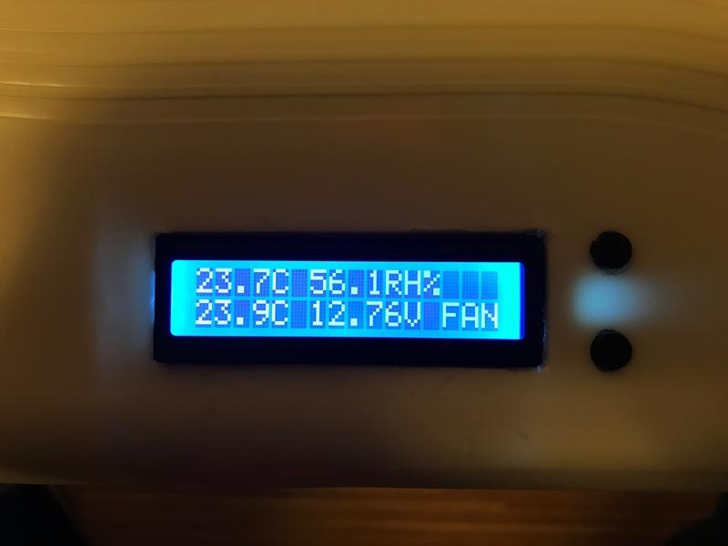
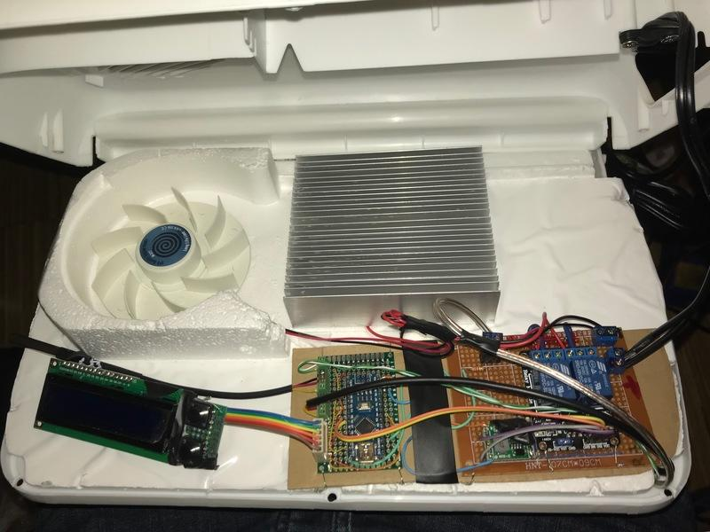

# CoolCooler

Get a cheap 12V cooler and pimp it with this Arduino project. 

__Features:__

- Low Battery Protection (so you dont kill your car's battery when you leave it plugged)
- Configurable Duty cycle (so it does not run non-stop)
- Internal/External temperature monitoring (so it stop cooling when is cold enough)
- LED light door (with soft fading)
- LCD 16x2 ([Hitachi style](https://en.wikipedia.org/wiki/Hitachi_HD44780_LCD_controller)) with a mini menu for configuration using two buttons. Simple LCD matching cheap aesthetics.

Low Battery protection
----------------------
It can be choosen between:
- **Always On**
- **12.5V "Battery Ok"**: So the battery will not fully discharge.
- **13.0V "Safe Start"**: A good battery should start a car if it has at least 13V.
- **13.8V "Engine On"**: Battery voltage stays above 13.8v under load when it is being charged by the engine's generator.

__NOTE__: Voltages will vary depending on the car, generator, leads thickness, etc. These are estimations.

Configurable Duty Cycle
-----------------------
- **Target 5C**: Runs until internal temperature drops below 5C.
- **Target 8C**: same but 8C.
- **25% Couple, 50% Fan**: Runs a cycle of approx. 10 minutes, the thermocouple is active 25% of the time, and the fan 50%.
- **50% Couple, 75% Fan**: like previous but 50% / 75%.
- **75% Couple, 100% Fan**: like previous but 75% / 100%.
- **Always On**: like its basic functionality.
- **Eco**: Targets to be under 10C but runs more if internal temperature is too far of it.

Circuit
-------
Picture below; diagram someday if somebody asks. The main components:
- Arduino Nano
- DC-DC regulator to lower the 12V (and maybe up to 15V) battery's voltage to a stable 5.5V, used to drive the arduino and the relays. 
- Input has a 18V zener diode and a normal diode for reverse polarity protection. The zener diode is for protection on any voltage spike i.e. modern generators that might put more than 30V at spikes, and the reverse polarity diode for protecting for voltage inversion after the ignition-engine stops, and also any inversed polarity that might happen by mistake.
- A module with two opto-isolated relay: thermocouple and fan.
- Hitachi HD44780 LCD 16x2 drived by a SPI interface.
- 2 Buttons, given there were enough pins available, no need to do any fancy stuff.
- Internal DHT22 for temperature and humidity monitoring.
- External classic one wire DS18D20.
- Door sensors (for internal light).
- LCD light run via PWM pin driving a TIP31C high power transistor.
- A voltage divider to measure the battery voltage.

I decided to split the circuits in three boards:
- LCD and buttons with a ribbon cable so it is easy to unplug while leaving it attached to the top-cover.
- "Low voltage" PCB with Arduino, sensors and logic.
- "High voltage" PCB with relays, 12V Power transitor, DC-DC step down circuit, etc.

Unfortunately, I haven't documented the circuit in detail, but if you ask I can improve it. It is not dificult, just by looking at the code you can see the pins for each device; the voltage divider can be configured in two `#define` by specifying the resistors you picked; there is no complicated external circuit, only the wiring in/out from the Arduino nano.

Pending, Bugs, etc.
-------------------
- Do a better job at estimating the battery's real voltage (i.e. when the thermocouple is active, the voltage drops below the safety threshold, therefore the thermocouple is disengaged by the low-battery-protection, this makes the voltage to raise back, and this subsequently start the thermocouple again... infinite loop! It should have a delay of a few minutes to let the battery recover... or at to least fluctuate less frequently). I haven't researched this much, but it can be due to a not very thick cable lead (generating a voltage drop) and I was also using a low-amp battery for testing (7A gel battery; given the Thermocouple draws 3A ... probably this might not happen with a car battery, needs to be investigated)
- PCB Layouts

Pics
====

The Cover, internal side
------------------------

The side that goes inside the coolbox. In the picture you can see three components, the LED strip (down, center), the door sensor (down, center) and the DHT22 temperature and humidity sensor (down, right). The black tape was temporary to keep the led strip in place while the glue was drying.

Display Close-up
----------------

Internal temperature and humidity, external temperature, voltage and only the fan is running now.
Yes, old school so it looks like the coolbox.

Guts
----

In this picture you can see 3 main circuits, from left to right:
- LCD and buttons
- Low voltage logic board with arduino and wiring to sensors
- High voltage with relays, power transistor for the LED strip and power conversors and protectors.
