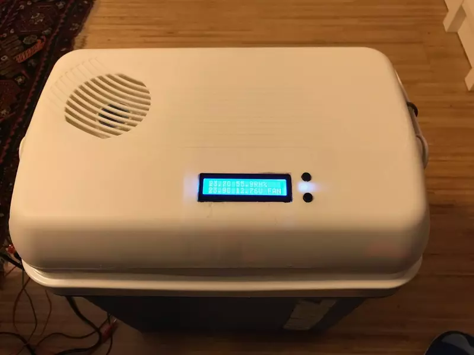
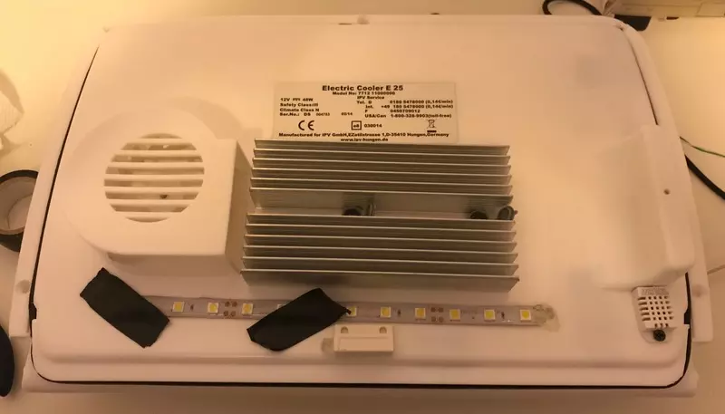
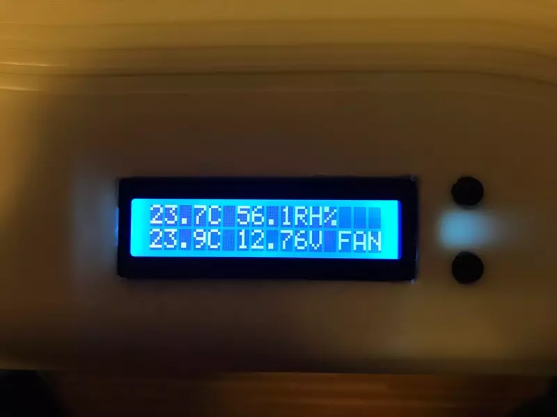
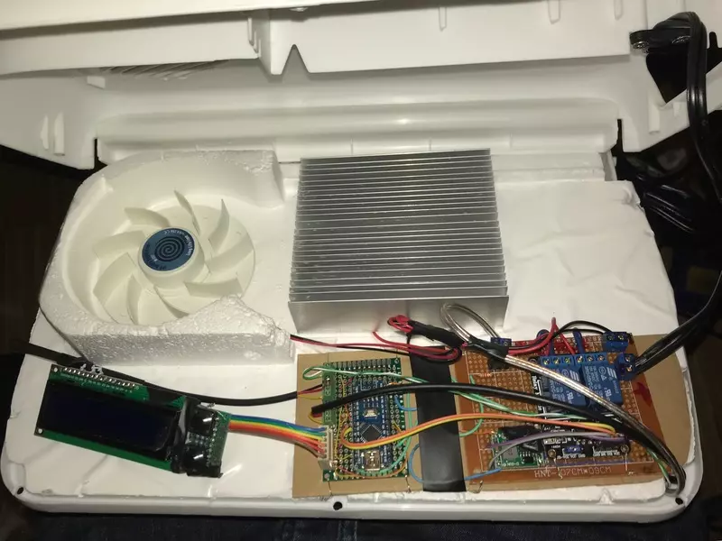

# CoolCooler

Get a cheap 12V cooler and pimp it with this Arduino project. 

Features:

- Low Battery Protection
- Configurable Duty cycle
- Internal/External temperature monitoring
- LED light door (with soft fading)
- LCD 16x2 ([Hitachi style](https://en.wikipedia.org/wiki/Hitachi_HD44780_LCD_controller)) with internal and external temperature and simple two buttons menu for configuration. Anything more fancy would not match the cheap aesthetics.

Low Battery protection
----------------------
Can be choosen between:
- **Always On**
- **12.5V "Battery Ok"**: So battery will not fully discharg
- **13.0V "Safe Start"**: A battery in good contion would be able to start with this voltage.
- **13.8V "Engine On"**: Battery voltage stays at 13.8v under load when it is actively being charged by the engine.

NOTE: Voltages will vary depending on the car, generator, etc. These are failr estimations.

Configurable Duty Cycle
-----------------------
- **Target 5C**: Runs until internal temperature drops below 5C.
- **Target 8C**: same but for 8C.
- **25% Couple, 50% Fan**: Runs a cycle of approx. 10 minutes, the thermocouple is active 25% of the time, and the fan 50%.
- **50% Couple, 75% Fan**: like previous.
- **75% Couple, 100% Fan**: like previous too.
- **Always On**: like its basic functionality.
- **Eco**: Targets to be under 10C but runs more if internal temperature is too far of it.

Circuit
-------
(Picture here) Diagram someday if somebody asks. The main components:
- Arduino Nano
- DC-DC regulator to lower the 12V battery to 5.5V, used to drive the arduino and the relays. It has a 18V zener diode and a normal diode for reverse polarity protection. The zener diode is for protection on any voltage spike i.e. after ignition.
- Opto-isolated two relay module: thermocouple and fan.
- LCD 16x2 drived by SPI interface.
- 2 Buttons, given there were enough pins available, no need to do it with resistors.
- Internal DHT22 for temperature and humidity monitoring.
- External classic one wire DS18D20.
- Door sensors (for internal light).
- LCD light run via PWM and a TIP31C.
- A voltage divider to measure the battery voltage.

I decided to split the circuits in three boards:
- LCD and buttons with a ribbon cable so it is easy to remove.
- "Low voltage" circuit with Arduino, sensors and logic.
- "High voltage" circuit with relays, 12V Power transitor, DC-DC step down circuit, etc.

Unfortunately, I haven't documented the circuit in detail, but if you ask I can go in details. It is not dificult, just by looking at the code you can see the pins for each device and, i.e. in the voltage divider you can configure the two resistors you picked for your project;here is no complicated circuit, only wiring into/out of the Arduino nano.

Pending, Bugs, etc.
-------------------
- Do a better job at estimating the battery's real voltage (i.e. when the thermocouple is active, the voltage drops below the safety threshold, therefore the thermocouple is disengaged by the low-battery-protection, this makes the voltage to raise back, and this subsequently start the thermocouple again... infinite loop! It should have a delay of a few minutes to let the battery recover... or at to least fluctuate less frequently). I haven't researched this much, but it can be due a not very thick cable lead (generating a voltage drop) and I was also using a low-amp battery for testing (7A gel battery; given the Thermocouple draws 3A ... probably this might not happen with a car battery, needs to be investigated)
- PCB Layouts

Pics
====

The Cover, internal side
------------------------

The side that goes inside the coolbox. In the picture you can see three components, the LED strip (down, center), the door sensor (down, center) and the DHT22 temperature and humidity sensor (down, right).

Display Close-up
----------------

Internal temperature and humidity, external temperature, voltage and only the fan is running now.
Yes, old school so it looks like the coolbox.

Guts
----

In this picture you can see 3 main circuits, from left to right:
- LCD and buttons
- Low voltage logic board with arduino and wiring to sensors
- High voltage with relays, power transistor for the LED strip and power conversors and protectors.
